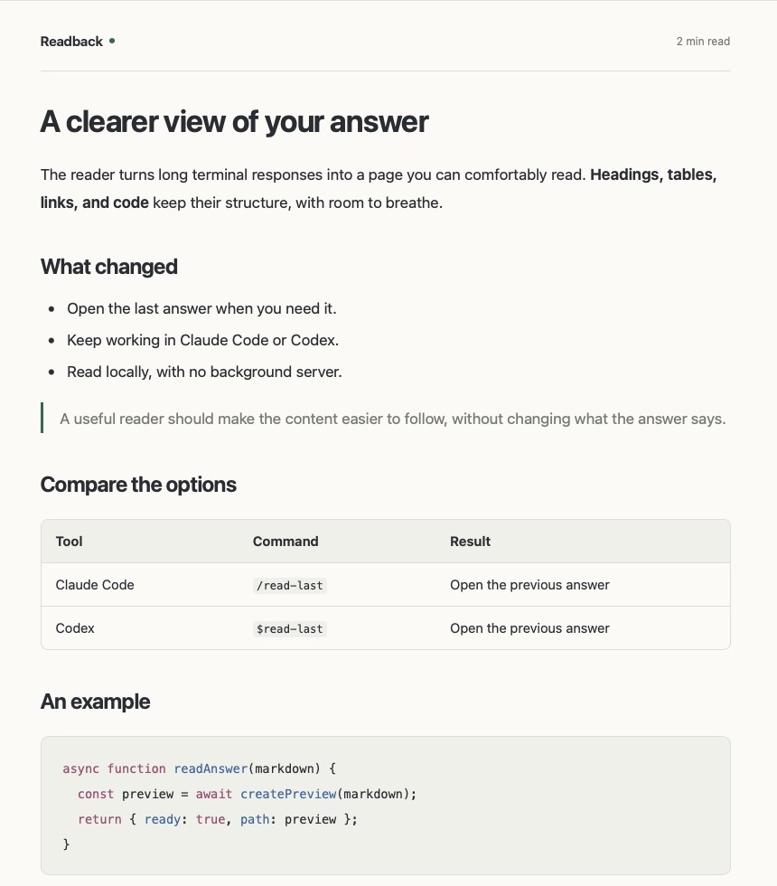

# Readback

Open the previous Claude Code or Codex answer as a quiet, readable page in your default browser.



## Commands

- **Claude Code:** `/read-last`
- **Codex:** `$read-last`

Run the command after an answer you want to read. The skill copies that answer from the current conversation and opens a local preview. It does not make a separate API call to generate an answer, but invoking the skill uses a normal agent turn. This is a context-based copy, not a byte-for-byte transcript export. If the prior answer is no longer available in context, the skill asks for the text.

## Setup

Requires macOS and Node.js 22 or later.

```sh
git clone https://github.com/esenilsson/readback.git
cd readback
npm ci
npm run install-skills
```

Installation creates personal `read-last` skills in `~/.codex/skills` (or `$CODEX_HOME/skills`) and `~/.claude/skills`. Existing skills are never overwritten. Start a new session if the command does not appear. Installed skills reference this checkout and the current Node executable by absolute path; keep both in place. To move the checkout, update the command in both installed skill files.

## Read a file directly

```sh
node src/cli.js answer.md
node src/cli.js --no-open answer.md
node src/cli.js - < answer.md
```

Each run creates a private `readback-*` directory under the system temporary directory, containing `answer.md` and `answer.html`. The generated path is always printed. Pages remain available until the temporary files are removed; there is no background process or history database. The reader does not delete past previews.

The page includes all CSS and highlighted code, uses the system light/dark preference, and makes wide code blocks and tables scrollable. Browser Find, zoom, and printing work normally. The footer saves the original Markdown. Embedded HTML displays as text; scripts are prohibited. Images appear as clickable references so opening a preview makes no network requests. Standard web links work; relative file links resolve from the temporary preview directory, not the original project.

## Verification

```sh
npm test
```

Tests cover rendering, unsafe input, content preservation, temporary output, CLI errors, and browser-launch failure. Browser visual checks should include a long response, wide tables, a narrow viewport, and both color schemes.
